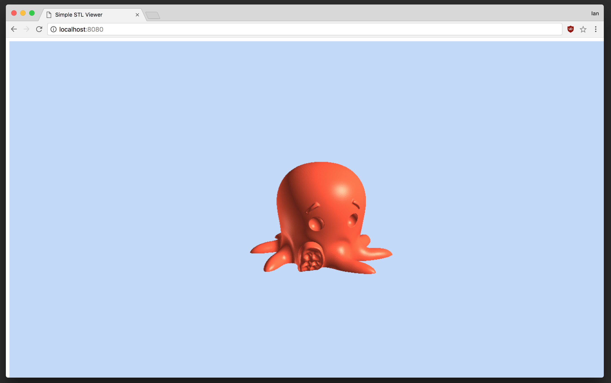

# Demo STL renderer

A demonstration of rendering a STL file in the browser using [three.js](https://threejs.org/).

- left-click-and-hold: rotate
- right-click-and-hold: pan
- mouse wheel: zoom
- drag-and-drop other STL files onto the webpage to render



### Running locally

```
npm install
npm run serve
```